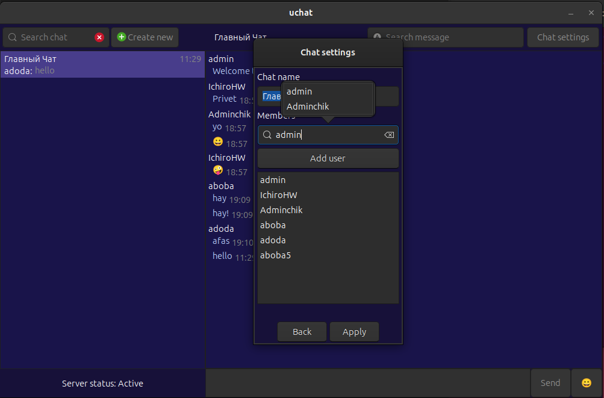

> ⚠️ Warning: This is a student project. Code quality may cause permanent brain damage. 
> View at your own risk. No warranty provided. Side effects may include:
> - Uncontrollable laughter
> - Desire to rewrite everything
> - PTSD from custom protocols

> Note: If you actually want to use this(What`s wrong with you??), 
> please seek professional help. Medical, not technical.

# UChat - Secure Messenger

A messaging application built in C with GTK+ GUI and client-server architecture. UChat provides real-time communication with encryption, group chats, user mentions, and administrative controls.

## Features

### 🖥️ Server
- **Multi-threading support** - Handle multiple clients simultaneously
- **Daemon mode** - Runs as background service
- **SQLite3 database** - Data storage for users, chats, and messages
- **OpenSSL encryption** - Traffic encryption for communications

### 💬 Client
- **GTK+ GUI** - Interface designed with Glade
- **Real-time messaging** - Message delivery and synchronization
- **Group chats** - Create and manage group conversations
- **User mentions** - Tag users with @ mentions
- **Message search** - Search through message history
- **Group invitations** - Invite users to join group chats
- **Administrative controls** - Manage users and groups
- **Auto-reconnect** - Automatic reconnection on network interruptions
- **Encryption** - Secure communication with OpenSSL

## Architecture

```
UChat/
├── client/                 # Client application
│   ├── inc/               # Header files
│   ├── libmx/             # Custom utility library
│   ├── resources/         # GUI resources and XML files
│   └── src/               # Source code
├── server/                # Server application
│   ├── inc/               # Header files
│   ├── libmx/             # Custom utility library
│   └── src/               # Source code
├── resources/             # Shared resources
│   └── uchat.db          # SQLite database
└── Makefile              # Build configuration
```

## Prerequisites

### Ubuntu/Debian
```bash
sudo apt-get update
sudo apt-get install build-essential libgtk-3-dev libsqlite3-dev libssl-dev libglade2-dev
```

### macOS
```bash
brew install gtk+3 sqlite3 openssl libglade
```

## Building

1. **Clone the repository**
   ```bash
   git clone <repository-url>
   cd uchat
   ```

2. **Build the project**
   ```bash
   make
   ```

## Usage

### Starting the Server

```bash
./server <ip> <port>
```

### Starting the Client

```bash
./uchat <ip> <port>
```

## Screenshots
### Authentication

*Login and registration interface with Sign In/Sign Up tabs*

### Main Chat Interface

*Main chat window showing message history, user list, and real-time messaging*

### Chat Settings

*Group chat management with member list and user administration*

### Chat Creation

*Create new chat dialog with contact search and selection*

### Message Search

*Search functionality to find messages across chat history with user mentions*

## Technical Details

### Custom Libraries
The project includes a custom utility library (`libmx`) with implementations of:
- Memory management functions
- String manipulation utilities
- Data structure operations (lists, arrays)
- Search and sort algorithms
- File I/O operations

### Database Schema
UChat uses SQLite3 for data persistence with tables for:
- User accounts and authentication
- Chat rooms and group information
- Message history and metadata
- User permissions and relationships

## License
This project is licensed under the MIT License.
